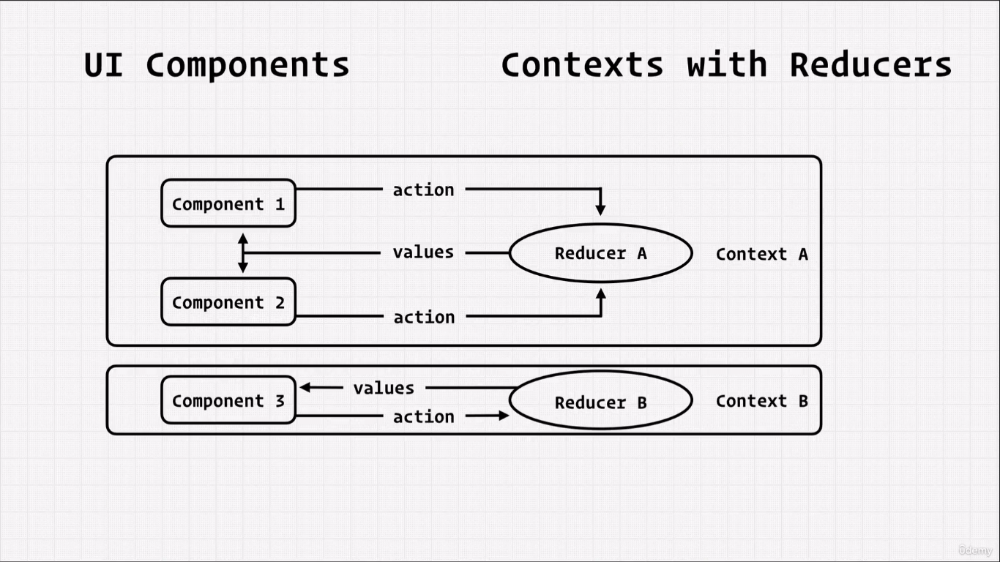
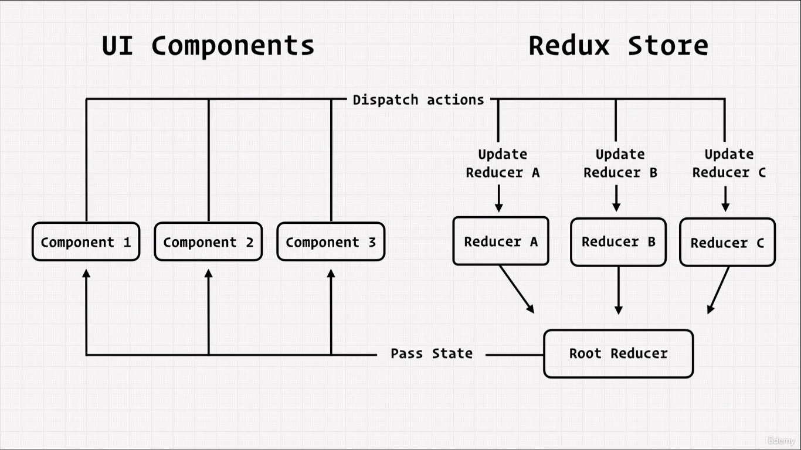

#### Context Api vs Redux

1. **Accessibility** : Redux always wrap the entire app, while with conext, which parts of app might require it (by wrapping appropriate component by context provider)

2. **Data Flow** : Redux has much more singular store so as a result a singluar dispatch, so its upto our reducers to determine if they wanna update state appropriately, while in context each useReducer has its unique state and dispatch.

